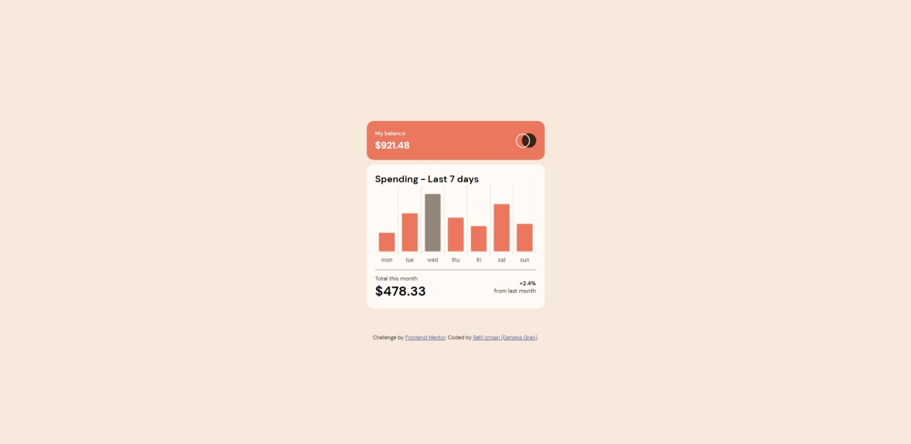

# Frontend Mentor - Expenses chart component solution

This is a solution to the [Expenses chart component challenge on Frontend Mentor](https://www.frontendmentor.io/challenges/expenses-chart-component-e7yJBUdjwt). Frontend Mentor challenges help you improve your coding skills by building realistic projects.

## Table of contents

- [The challenge](#the-challenge)
- [Screenshot](#screenshot)
- [Links](#links)
- [Built with](#built-with)
- [What I learned](#what-i-learned)
- [Useful resources](#useful-resources)
- [Author](#author)

## The challenge

Users should be able to:

- View the bar chart and hover over the individual bars to see the correct amounts for each day
- See the current day’s bar highlighted in a different colour to the other bars
- View the optimal layout for the content depending on their device’s screen size
- See hover states for all interactive elements on the page
- **Bonus**: Use the JSON data file provided to dynamically size the bars on the chart

## Screenshot

### Links

- Solution URL: [Add solution URL here]
- Live Site URL: [https://genesisgran.github.io/expenses-chart-component/]

## Built with

- Semantic HTML5 markup
- CSS custom properties
- Flexbox
- Media Query
- Javascript
- Mobile-first workflow
- [Chart.js](https://www.chartjs.org/)

## What I learned

I learned how to use data to make a bar chart on javascript and how to styling them with [Chart.js](https://www.chartjs.org/).

## Author

- Frontend Mentor - [@GenesisGran](https://www.frontendmentor.io/profile/GenesisGran)
- Github - [Genesis Gran](https://github.com/GenesisGran/)
- Discord - Genesis Gran#9500
